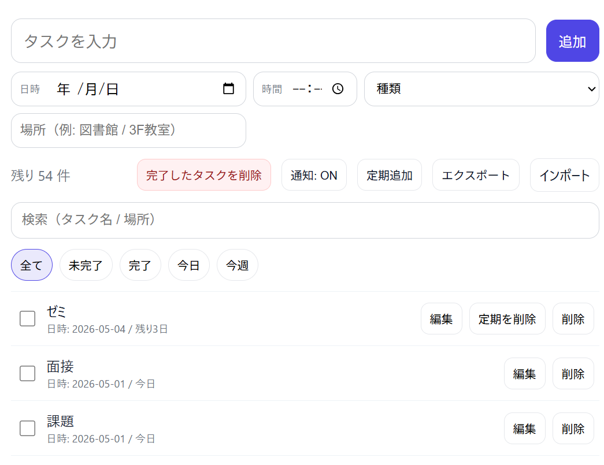
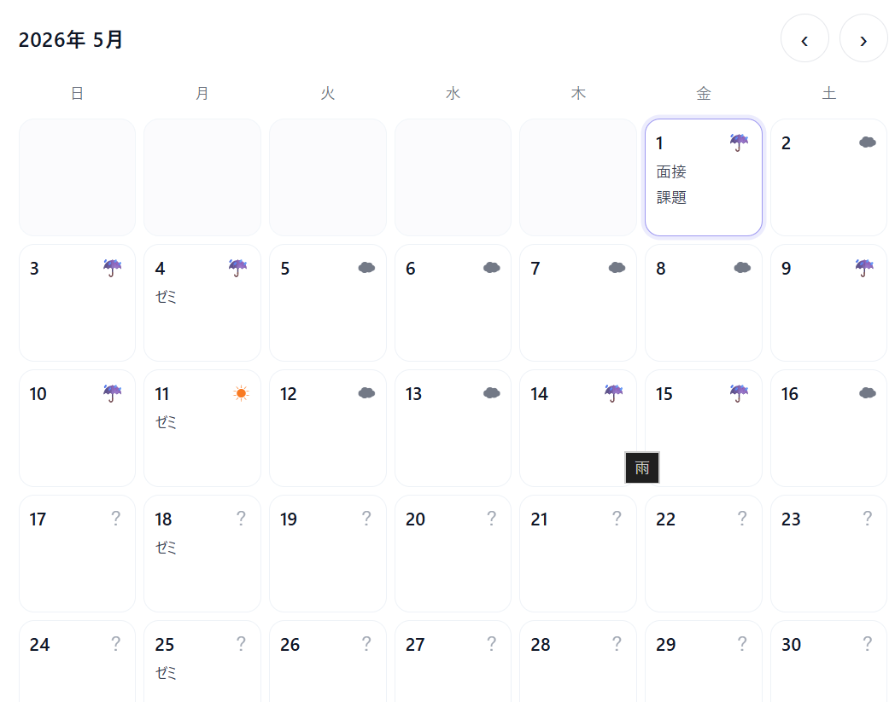

# Full‑stack Todo（Vanilla JS + Express + SQLite）

Vanilla JSで作ったフロントと、Express + SQLiteのバックエンドをつないだ **フルスタックTodoアプリ**です。  
**ログイン（Cookieセッション）**でユーザーを分離し、期限（日時）・カレンダー・定期予定・通知など「実際に使える」機能を段階的に実装しました。

## Demo
- **URL**: `https://full-stack-todo-7aw9.onrender.com/`

### Screenshot




---

## このアプリでできること（機能一覧）

### 認証・データ分離
- **新規登録 / ログイン / ログアウト**
- **ユーザーごとにTodoを分離**（他人のTodoは見えない/操作できない）

### Todo管理
- **作成/取得/更新/削除（CRUD）**
- **完了切替**
- **編集モーダル**でまとめて更新（タスク名/完了/日付/締め切り時刻/場所/種類）
- **残り日数表示**（今日 / 残りN日 / 期限切れN日）
- **期限が近い順**で表示（並び順保存が無い場合）
- **期限なし（あとで）**を専用エリアに分離表示

### 使いやすさ（UX）
- **検索**（タスク名/場所の部分一致）
- **ドラッグ&ドロップ並び替え**（並び順をDBに保存）
- **完了一括削除**
- **Enterで追加 / Shift+Enterで改行**（入力欄はtextarea自動伸縮）
- **エクスポート/インポート（JSON）**

### カレンダー・予定機能
- **月カレンダー表示（前後月移動）**
- 期限日のTodoを日付セルに表示（最大3件 + `+N件`）
- **定期予定（毎週）を1年先まで自動追加**
  - シリーズ（1グループ）として扱い、一覧には **直近1件だけ**表示
  - **シリーズ一括削除**ボタンあり

### 天気（東京固定）
- Open‑Meteoから取得して、カレンダーに **☀/☁/☔** を表示
- **予報は最大16日先まで**のため、それ以降は **「？」（未定）**表示

### 通知
- ブラウザ通知（許可制）
- **締め切りの1日前**に通知（次の7日以内だけスケジュール）

---

## 全体構成（Architecture）

- **Frontend**: `Todo/vanilla-js-todo/`
  - `state（todos）→ render（DOM）` の一方向で管理
  - `fetch` は `credentials: "include"` でセッションCookieを送信
- **Backend**: `backend/server.js`
  - ExpressでAPI + 静的配信（同一オリジン化）
  - SQLite（better-sqlite3）で永続化

---

## 工夫点 / 難しかった点（どう解決したか）

### 1) 「ログイン状態」をフロントに安全に反映
- **課題**: ログインフォームをTodo画面に同居させるとUXが崩れる。未ログイン時の状態も分かりにくい。
- **解決**: `GET /me` でセッションを確認し、ヘッダー右上の `#authSlot` に状態（ログイン/ログアウト）を描画。

### 2) 期限日（DB）と表示（JS）の命名差
- **課題**: DBは `due_at`（snake_case）、JSは `dueAt`（camelCase）で混乱しやすい。
- **解決**: **DB⇔JSON変換層**を明示し、フロントは `dueAt` に統一。

### 3) PATCHの互換維持（doneトグル → 編集APIへ拡張）
- **課題**: 最初は `PATCH /todos/:id` を「doneトグル」だけにしていたが、後から編集もしたい。
- **解決**: **body無しならトグル / bodyありなら更新**という互換仕様にして、段階的な拡張に耐える形に。

### 4) 天気APIの仕様差・取得可能範囲の制約
- **課題**: Forecast APIは未来が最大16日程度で、月末まで取ろうとすると400になる。`weathercode` と `weather_code` の差もある。
- **解決**:
  - 過去は archive API、未来は forecast APIでマージ
  - 16日以降は「未定」表示にしてUXを崩さない

### 5) 定期予定が増えすぎて一覧が崩壊する問題
- **課題**: 1年先まで毎週追加すると、一覧が大量になり、操作性が落ちる。
- **解決**:
  - DBに `recurrence_id` を追加し「シリーズ化」
  - 一覧は **直近1件のみ表示**
  - 「定期を削除」でシリーズ一括削除

---

## API（主要エンドポイント）

### Auth
- `POST /auth/register`
- `POST /auth/login`
- `POST /auth/logout`
- `GET /me`

### Todos
- `GET /todos`
- `POST /todos`
- `PATCH /todos/:id`
- `DELETE /todos/:id`
- `POST /todos/reorder`
- `POST /todos/bulk`
- `DELETE /recurring/:recurrenceId`

---

## Local Setup（ローカルで動かす）

### 1) インストール

```bash
npm install
```

### 2) 起動

```bash
npm run dev
```

### 3) アクセス
- `http://localhost:3001/`

---

## セキュリティ/運用メモ（今後の伸びしろ）
- セッションsecretを **環境変数**へ（今は学習用の固定値）
- Cookieセッションの **CSRF対策**
- レート制限（ログイン試行など）
- APIテスト追加（回帰防止）

---

## ドキュメント
- `docs/BUILD_GUIDE.md`（0から再現するための作り方）