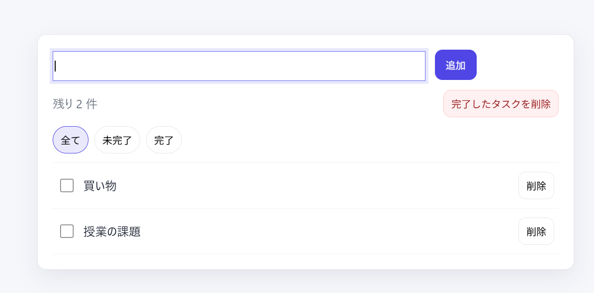

# Full-stack Todo (Vanilla JS + Express + SQLite)

ブラウザで動くフロント（バニラJS）と、APIサーバ（Express）を分離し、SQLiteで永続化したTodoアプリです。
フロントは `fetch` でAPIを呼び出し、サーバ（DB）を正（source of truth）としてCRUDを行います。

## Demo
- **URL**: `https://full-stack-todo-7aw9.onrender.com/`

### Screenshot


## What I built (機能)
### Core
- **Todo CRUD**（作成/取得/更新/削除）
- **完了切替**（done）
- **フィルタ**（全て/未完了/完了）

### UX
- **完了一括削除**
- **残り件数表示**
- **空状態メッセージ**
- **Enterで追加**

## Architecture (全体構成)
- **Frontend**: `Todo/vanilla-js-todo/`
  - state → render でUIを一方向に更新
  - API呼び出し後に再取得してUIを確実に同期（最初は正確性優先）
- **Backend**: `backend/`
  - ExpressでAPI（GET/POST/PATCH/DELETE）
  - SQLite（`todos.db`）に永続保存（サーバ再起動でもデータが残る）

## API (Endpoints)
- `GET /health` : 疎通確認
- `GET /todos` : Todo一覧
- `POST /todos` : Todo追加
  - body: `{ "text": "..." }`
- `PATCH /todos/:id` : done切替
- `DELETE /todos/:id` : Todo削除

## Highlights (工夫点 / アピール)
- **フロントとバックエンドの分離**: UIロジックとデータ操作を分け、フルスタックの開発フロー（API設計→接続）を経験
- **RESTっぽいCRUD設計**: GET/POST/PATCH/DELETEを揃え、拡張（認証・ユーザー分離）に繋げやすい形にした
- **DB永続化**: メモリ配列→SQLiteへ移行し、再起動耐性を確保
- **入力バリデーション**: 空白のみの入力を弾き、エラー（400）を返す
- **デバッグ耐性**: `Cannot GET` / `MODULE_NOT_FOUND` / `http vs https` 等のエラーを切り分けながら改善

## Tech Stack
- **Frontend**: HTML / CSS / JavaScript（Vanilla）
- **Backend**: Node.js / Express
- **DB**: SQLite（better-sqlite3）

## Local Setup (動かし方)
### 1) Backend
```bash
cd backend
npm install
node server.js
```

確認:
- `http://localhost:3001/health`
- `http://localhost:3001/todos`

### 2) Frontend
`Todo/vanilla-js-todo/index.html` をブラウザで開きます（APIサーバが起動している必要があります）。

## Notes
- `backend/node_modules/` と `backend/*.db` はGit管理しません（`.gitignore`で除外）。

## Future Work (次にやること)
- **認証（ログイン）** + ユーザーごとのTodo分離（usersテーブル、`user_id`）
- **デプロイ**（URLで触れる状態にする）
- **テスト追加**（APIの基本動作）
- **DB移行**（PostgreSQL等、実運用寄りの構成）